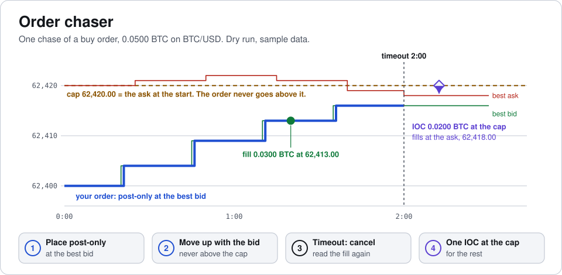
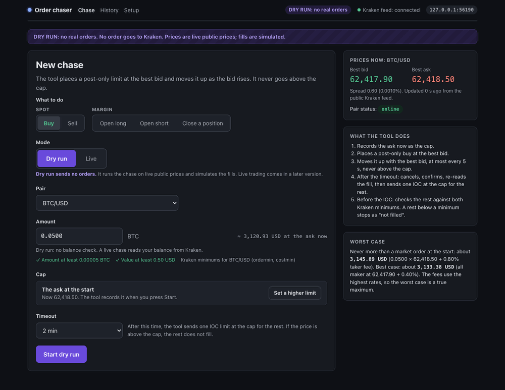
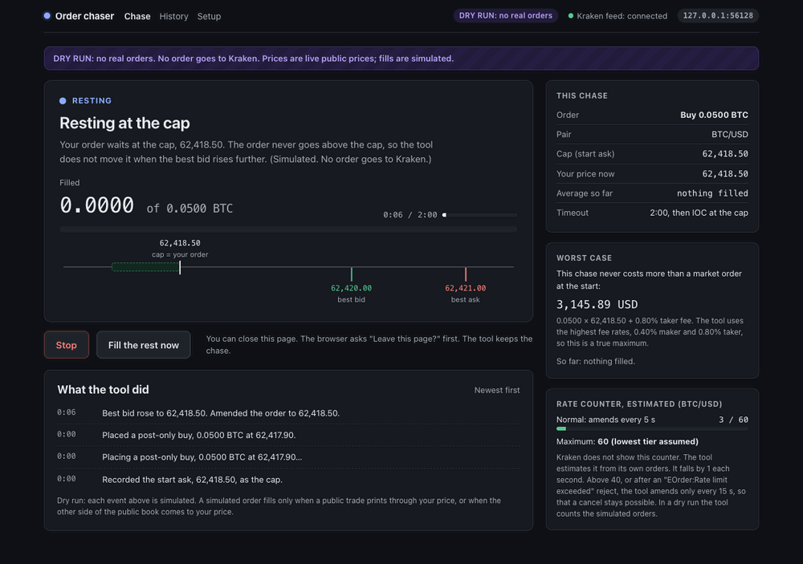
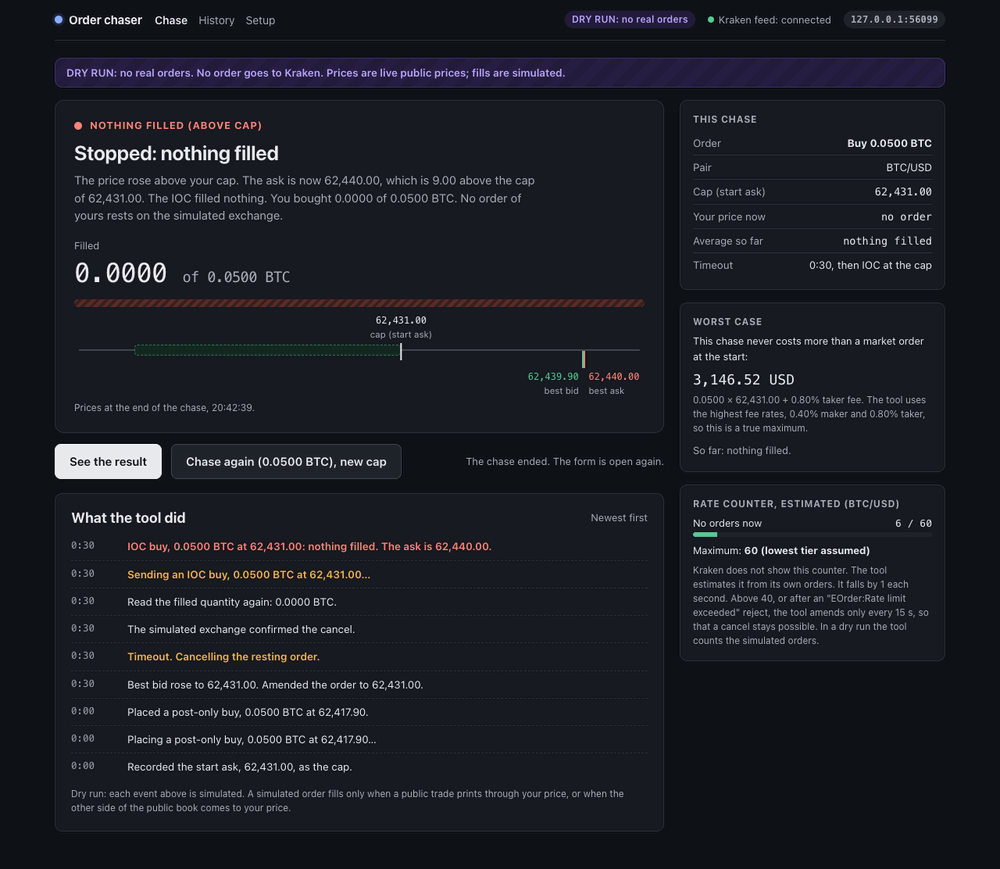

<a href="docs/assets/hero-light.svg">
<picture>
  <source media="(prefers-color-scheme: dark)" srcset="docs/assets/hero-dark.svg">
  
</picture>
</a>

<p align="center">
  <a href="https://github.com/erickb336/order-chaser/actions/workflows/check.yml"></a>
  <a href="LICENSE"></a>
</p>

**Order chaser is a local tool for Kraken Pro that chases a post-only limit order at the best bid, never above a cap, and sends one IOC for the rest at the end.**

You give it a pair, an amount and a timeout. It places a post-only buy at the best bid and moves it up as the bid rises. It never goes above the cap: the ask at the start. After the timeout, it cancels, reads the filled quantity again, and sends one IOC (immediate-or-cancel) order at the cap for the rest. A sell is the mirror, with a floor (the bid at the start). It also chases margin orders: open a long or a short at 2x to 5x, and close a position with a reduce-only order.

> [!IMPORTANT]
> **Every chase is a dry run unless you choose Live for it.** A dry run reads live public Kraken prices and simulates the fills; it reads no key and sends no order. A live chase (spot only, task T4) sends real orders to your Kraken account after Setup and a confirm. The live code is tested only against a local fake Kraken: the first real order (U7, 0.0001 BTC) waits for the owner's go-ahead. Live margin is not built.

**Contents:** [Quick start](#quick-start) · [Learn it in 5 minutes](#learn-it-in-5-minutes) · [How it works](#how-it-works) · [Concepts](#concepts) · [Options and tests](#options-and-tests) · [FAQ](#faq) · [Under the hood](#under-the-hood) · [Credits](#credits) · [Licence](#licence)

## Quick start

You need a Mac with git. The server listens on 127.0.0.1 only.

**1. Install [uv](https://docs.astral.sh/uv/getting-started/installation/)** (skip this step if `uv --version` works):

```bash
curl -LsSf https://astral.sh/uv/install.sh | sh
```

**2. Get the code and start the tool.** uv installs Python 3.12 and the pinned packages from `uv.lock` on the first run.

```bash
git clone https://github.com/erickb336/order-chaser.git
cd order-chaser
uv run order-chaser
```

**3. Open <http://127.0.0.1:5180>.** The form opens in dry run. Press **Start dry run**.

The first start downloads Python and 17 packages, so its time depends on your network. A later start takes a few seconds.

## Learn it in 5 minutes

This is one chase, step by step. It is an illustration with sample data: the prices and the fills are made up.

<a href="docs/assets/walkthrough-light.svg">
<picture>
  <source media="(prefers-color-scheme: dark)" srcset="docs/assets/walkthrough-dark.svg">
  
</picture>
</a>

1. **Fill in the form.** Pick what to do (Buy, Sell, Open long, Open short or Close a position), the pair, the amount and the timeout. The form shows the cap and the worst case before you start.
2. **The tool records the cap.** For a buy, the cap is the ask when you press Start. So a chase never costs more than a market order at the start. A higher cap needs a tick box that accepts the extra cost.
3. **The order chases the bid.** The tool places a post-only order at the best bid. When the bid moves, it amends the order, at most every 5 s. It never goes above the cap.
4. **Fills come in.** In a dry run, a fill comes only from the public market: a public trade through your price, or the other side of the book at your price. The page shows each fill.
5. **The timeout ends the chase.** The tool cancels, waits for the confirmation, and reads the filled quantity again. Then it sends one IOC at the cap for the rest. If the price is above the cap, the rest does not fill.
6. **Read the result.** The result shows the fills, the average price and the fees (estimates). History keeps every chase.

You can also press **Fill the rest now** (cancel, read again, IOC at once) or **Stop** (cancel, no IOC) at any time.

### The real screens

These are real screens of the tool. The page tests drew them with a fake feed and sample prices. The port in the top bar is the test's own port. The pages are dark. Every text keeps a contrast of 4.5:1 or more; the page tests check it.

| New chase (the form) | A chase that rests at the cap |
| --- | --- |
|  |  |
| **The end: timeout, then the IOC** | **A margin close, with its plan** |
|  |  |

**Try it yourself.** Start the tool, buy 0.0010 BTC with a timeout of 30 s, and watch the order follow the bid. Nothing goes to Kraken. To see the rare states without the market, see [Tests](#tests).

## How it works

The tool is one Python server on 127.0.0.1 and five pages. A pure core decides each step of a chase. A simulator answers like an exchange. In T4, the Kraken gateway takes the place of the simulator, and the core stays the same.

| Part | File | Job |
| --- | --- | --- |
| Core | `src/order_chaser/core.py` | `step(chase, event) -> (chase, commands)`. No I/O, no clock. All chase rules are here. |
| Simulator | `src/order_chaser/sim.py` | The dry-run gateway and the simulated margin account. It answers the core's commands like an exchange. A later version puts the Kraken gateway in its place. |
| Feed | `src/order_chaser/feed.py`, `book.py` | Public WebSocket v2 book (depth 10, CRC32 checksum) and trades; REST AssetPairs for minimums, tick size and pair status. |
| Key store | `src/order_chaser/keys.py` | The Kraken API key in the macOS Keychain (`keyring`, item "Kraken API key (order-chaser)"). Read one time at each start of the tool (macOS asks: click Allow), kept only in memory. |
| Kraken gateway | `src/order_chaser/kraken.py` | Live: AddOrder (post-only, IOC at the cap), amend_order on WebSocket v2, CancelOrder, QueryOrders by our order id (cl_ord_id); the private executions feed; the safety timer (CancelAllOrdersAfter 60 s, renewed every 20 s, 0 at the end); caffeinate; the restart reconcile. |
| REST client | `src/order_chaser/rest.py` | The signed Kraken REST client (HMAC-SHA512 `API-Sign`, a nonce that always increases, the Starter REST rate counter: at most 15, falls 0.33 each second) and the permission test of a key. |
| Database | `src/order_chaser/db.py` | SQLite: one row for each chase, an append-only event log, a table that maps each order id (leg) to its chase, and the simulated account. |
| Server | `src/order_chaser/server.py` | Runs the chase, serves the pages, pushes updates by server-sent events. It sends the core's commands to the gateway one at a time with an async call (`await gateway.send(command)`), so that a slow call to Kraken does not stop the prices, the timer or Stop. |

### Chase states

<a href="docs/assets/states-light.svg">
<picture>
  <source media="(prefers-color-scheme: dark)" srcset="docs/assets/states-dark.svg">
  
</picture>
</a>

The core is one function: `step(chase, event) -> (chase, commands)`. It has no I/O and no clock. Each event (a new book, a fill, a confirmation, a button) moves the chase to its next state and gives the commands to send.

### Margin flow

<a href="docs/assets/margin-light.svg">
<picture>
  <source media="(prefers-color-scheme: dark)" srcset="docs/assets/margin-dark.svg">
  
</picture>
</a>

### Rules held in code

These rules are in the core, the simulator and the server. The tests check them.

#### Chase rules (dry run)

- A simulated buy at price P fills only when a public sell trade prints below P. The fill is the smaller of the rest and the trade quantity. A sell is the mirror.
- A resting simulated buy at P also fills, as maker at P, when the public ask comes to or below P, up to the size at those levels. A price level fills the order at most up to the largest size seen there. A sell is the mirror.
- If a cancel is rejected and the order is still open, the tool tries again (3 tries in total, within the rate counter). A reject for the rate limit sets the counter to 60, so the next try waits for it to fall. After 3 tries the chase ends. A live chase then tells you to check Kraken Pro; a dry run has nothing to check there.
- The price feed counts as lost after 10 s with no message (Kraken sends a heartbeat each second). The tool never amends and never sends the IOC on a book older than 10 s. Start also needs a book at most 10 s old.
- If the timeout comes while the price feed is lost, the tool cancels and sends no IOC: there is no valid price.
- A post-only place or amend at or above the best ask is rejected (sell: at or below the best bid).
- The IOC fills against the public book up to the cap.
- A limit past the price now (a higher cap, a lower floor) needs a tick box that accepts the worst extra cost. A limit at the price now (the ask for a buy, the bid for a sell) needs none.
- Fees: 0.40% maker and 0.80% taker, the highest Kraken rates.
- The rate counter copies Kraken's Starter tier (maximum 60, falls 1 each second). Above 40 the tool amends every 15 s, not 5 s.

#### Margin rules (dry run)

- "What to do" on the form: Buy or Sell (spot), Open long, Open short or Close a position (margin).
- Leverage: 2x to 5x, and only the levels that the pair allows (AssetPairs `leverage_buy`, `leverage_sell`). The form starts at 2x.
- The simulated account starts with 5,000 USD and is in the SQLite file, so a position stays open after a restart. Mixed leverage works as on Kraken: each open is its own position, with its own leverage, entry, collateral and rollover start (the fills of one chase make one position). Long and short on one pair are never open together. The close list shows one row for each pair and direction, with the count and the average leverage (cost ÷ collateral, rounded): "BTC/USD long · 2 positions · average 4x". A close takes the oldest position first (FIFO), partly if needed. One rule (`core.close_plan`) makes this plan, for the account and for every screen: the form says which positions a close takes and what stays ("Closes, oldest first: the 2x position opened 12:59 (0.0100 BTC) and 0.0050 BTC of the 4x position opened 13:00. Stays open: 0.0150 BTC at 4x."), with the margin level after it; the chase page says what the fills took so far; the result shows the profit or loss of each position that the close took. `GET /api/plan?pair=&dir=&qty=` gives the plan of a size to the form. It refuses (400) a size that `POST /api/chase` refuses for a close, with the same text: above the position, below the Kraken minimum, or too many decimals.
- Mark = the mid of the last valid public book of each pair, with its time. The tool watches one pair, so another pair shows "at the last price seen, HH:MM:SS"; the tool subscribes to no extra pair. The marks are not saved: after a restart a pair shows "no price yet" until its book arrives, and its profit or loss counts as 0 in the margin level. Margin level = equity ÷ used margin × 100. At the pair's `margin_stop` (AssetPairs, 40% today) the simulated exchange liquidates every position when a book arrives, each at the mark of its own pair, and a running chase ends.
- A liquidation always makes the tool read the account at once, also when no chase runs. The form then shows a notice: which positions closed, at what mark, their profit or loss, and when. The notice shows the last liquidation until a new one comes. When the book that liquidates also fills the rest of a chase order (the simulated exchange fills first, then marks), the chase ends as "liquidated", not "filled".
- The result page offers the close of a position only while the account has a position of that chase (`open_now`, read when the page loads). So a result after a later liquidation or a restart does not claim a position that is gone.
- Fees: opening fee and rollover at 0.05% of the cost, the stated maximum of Kraken US (0.01% to 0.05%). The pages label these numbers as estimates. Rollover counts each full 4 h after the open of each position (as Kraken: nothing before the first 4 h).
- Start needs enough free margin for orders: cost ÷ leverage. An open against an open position of the other direction is blocked: "Close the long first" (or the short).
- A close is reduce-only: the order can only make the position smaller. It starts at the whole position; you can make it smaller. A rest below the Kraken minimum gets a warning, not a block.
- The simulated exchange refuses with Kraken's texts: "Insufficient margin", "Margin allowance exceeded", "Margin position size exceeded" (AssetPairs position limits), "Cannot open opposing position", and "Reduce only:No position exists".
- If the exchange refuses an amend of a margin order, the tool cancels and replaces for the rest of the chase: cancel, wait for the confirmation, read the filled quantity of that order, place a new order for the rest at the bid. A move (a cancel or a new order) comes at most every 5 s (15 s above 40 on the rate counter). A new order goes out only when the rate counter keeps room for its cancel.
- If the exchange refuses a new order because it would cross, or for the rate limit (this sets the counter to 60), no order rests: the tool places it again after the wait, until the timeout. "Fill the rest now" and the timeout then read the filled quantity again and send one IOC at the cap for the rest; Stop ends the chase as stopped. Another refusal (for example "EOrder:Insufficient margin") ends the chase with the exchange's text.
- The result and the history judge a close by its order, not by the position. When the whole order fills, they say "Closed as asked" ("Position closed" when nothing stays), and what stays open is a plain fact: "Stays open: 0.0150 BTC at 4x". Only the part of the order that did not fill is red: "Not closed: 0.0030 BTC". The numbers and the bar use the order size.
- `POST /api/chase` takes what to do in one field, `what` (buy, sell, long, short, close-long, close-short), and `leverage` only for long and short. A request with `side`, with leverage for buy, sell or a close, or with no leverage for an open gets 400 and a message.
- Each order of a chase has its own client order id of at most 18 characters (Kraken's limit): `oc` + 12 hex for the first order, `-1`, `-2`, … for the new orders of a cancel and replace, and `-i` for the IOC. The filled quantity is the sum of what the exchange reports for each order, so a fill never counts twice.
- The tool reads the account and the positions at the start of a chase, after fills (at most every 3 s), at the end, at a liquidation, and when the form opens. It never reads them every second.

#### Safety

- The server refuses a request whose Host is not `127.0.0.1:<port>` or `localhost:<port>`.
- The tool changes the watched pair at most once each second. A faster change gets 429, so that Kraken does not refuse the subscriptions. If Kraken refuses a subscription, the tool counts the feed as lost and connects again.
- No page shows inside a frame of another site (`X-Frame-Options: DENY`, CSP `frame-ancestors 'none'`).
- Every response sends a full Content Security Policy: `script-src 'self'`, `connect-src 'self'`, `object-src 'none'`, `base-uri 'none'`, `form-action 'none'`. Each page runs only from its own script files in `static/` (no inline script, no `eval`). The page tests fail on any CSP refusal in Chrome.
- A request that changes state needs the tool's own Origin and a session token. Only the pages that the server sends get the token.
- If the tool stops during a chase, the chase ends at the next start. The tool does not continue it. A live chase first goes to the restart reconcile (see below).
- `POST /api/key/test` tests each permission of the saved key with a call that changes nothing: Balance (Query Funds), AddOrder with `validate=true` (Modify Orders), CancelOrder on an order id that does not exist (Cancel/Close Orders: "Unknown order" means on, "Permission denied" means off), OpenOrders, ClosedOrders, GetWebSocketsToken, and WithdrawMethods (Withdraw Funds; it tells only when Query Funds is on). A key without Query Funds is not usable. A key that can withdraw is refused and removed from the Keychain at once.
- The key endpoints (`POST /api/key` with JSON `api_key` and `private_key`, `POST /api/key/remove`) need the Origin and the session token like every other change. The tool checks the shape of the key (base64; the private key is 64 bytes), writes it only to the Keychain, and never puts it in a response, a log or the SQLite file. A test checks this with a dummy key. The tests use an in-memory keyring (`tests/conftest.py`), never the real Keychain.

#### Live rules (T4)

- **Setup** (`GET/POST /api/setup`): the account question comes first (Q10). "Another bot or API tool uses this account" keeps live chases off until you confirm a Kraken sub-account for the tool (G19). The key must pass `POST /api/key/test`; a new key needs a new test.
- **The live check** (`POST /api/live/check`) before each live start: Setup, live prices, the key (macOS asks one time at each start of the tool, Q9), the WebSocket token, and your other open orders. `POST /api/chase` with `"mode": "live"` runs the same check again. The first live order uses the Kraken minimum and needs one tick (Q6). Open stop-loss or take-profit orders need one tick at each live chase (Q7).
- **Kraken does not answer**: a read of the order with no answer for 60 s ends the chase ("Kraken did not answer"). The tool keeps the safety timer as the backstop: it does not set it to 0, so Kraken cancels the order.
- **The private feed is lost**: the order stays; the tool reads it by REST every 5 s and pauses amends (Q8).
- **The timer fired**: the chase ends with no IOC. The tool reads which of your other orders Kraken cancelled, stop-loss and take-profit first, and lists them. It never places them again (C8, G19).
- **The tool stops during a live chase**: the timer stays on, and Kraken cancels ALL orders of the account within 60 s. The chase page, the shutdown log line and the next start say so.
- **Restart reconcile** (Q5): at the next start, the tool reads the orders of that chase by cl_ord_id, cancels one that is still open, records the fills, sets the old timer to 0 and shows the reconcile page. While Kraken cannot be read, new live chases are blocked, and the page says why.

#### Real-Kraken checks for U7 (the first live order, with the owner's go-ahead)

The fake Kraken in `tests/fake_kraken.py` follows Kraken's documentation. These points need the real Kraken:

1. The permission labels on the Kraken key page match the support article (C9).
2. `AddOrder` with `validate=true` and `CancelOrder` on an unknown id give the errors that the permission test expects.
3. The `cl_ord_id` of AddOrder is accepted (18 characters at most) and `QueryOrders` by `cl_ord_id` finds the order.
4. `amend_order` on WebSocket v2 by `cl_ord_id` with `post_only` moves the order.
5. The executions feed sends `snap_orders` and `snap_trades`, and `cum_qty`, `last_qty` and `liquidity_ind` as the mapping expects.
6. `CancelAllOrdersAfter` 60 and 0 work, and the reason text of a timer cancel; the window that lists the other cancelled orders (`ClosedOrders` with `start`) finds them.
7. The status and `closetm` of a cancelled leg after a restart, for the "timer" finding.
8. The minimum of BTC/USD (0.0001 BTC in the design) against `ordermin` from AssetPairs.
9. The macOS Keychain prompt at the first live call after a start names `python3`, and Allow works (Q9).
10. caffeinate keeps the Mac awake during the chase and stops after it.

Left out of this version: live margin (it needs the live position reads), and a second reconcile for a chase that ended with "Kraken did not answer".

## Concepts

The pages and this README use one word for each thing.

| Word | Meaning |
| --- | --- |
| **chase** | One run of the tool for one order: from Start to a result. |
| **post-only** | A limit order that only rests on the book. If it would fill at once (cross the spread), the exchange rejects it. So each fill of the chase is a maker fill, with the lower fee. |
| **cap** | The highest price of a buy chase: the ask at the start. The order and the IOC never go above it. A higher cap needs a tick box that accepts the extra cost. |
| **floor** | The lowest price of a sell chase or a close of a long: the bid at the start. It is the mirror of the cap. |
| **amend** | A change of the price of the resting order. The tool amends at most every 5 s (every 15 s above 40 on the rate counter). |
| **fill** | A part of the order that the exchange (in a dry run, the simulator) executed. The filled quantity is the sum of all fills. |
| **IOC** | Immediate-or-cancel: an order that fills at once what it can, up to its price, and cancels the rest. The chase sends at most one, at the cap. |
| **dry run** | The mode of each chase unless you choose Live. Live public prices, simulated fills, a simulated account, no key, no order to Kraken. |
| **live chase** | A spot chase with real orders on your Kraken account. Needs Setup (account question, tested key) and a confirm. |
| **safety timer** | Kraken's CancelAllOrdersAfter: during a live chase Kraken cancels ALL orders of the account 60 s after the last renewal. The tool renews it every 20 s and sets it to 0 at the end. If the tool stops, Kraken cancels the orders. |
| **simulated account** | The margin account of the dry run: 5,000 USD at the start, kept in the SQLite file. |
| **position** | An open margin trade. Each open is its own position, with its own leverage, entry, collateral and rollover start. |
| **leverage** | How many times the collateral the position is worth: 2x to 5x, and only the levels that the pair allows. |
| **reduce-only** | An order that can only make a position smaller. It can never open a position or make one larger. Every close is reduce-only. |
| **FIFO** | First in, first out: a close takes the oldest position first, and a part of the next one if needed. |
| **mark** | The mid of the last valid public book of a pair. The tool values each position at the mark. |
| **margin level** | Equity ÷ used margin × 100. Kraken calls margin at 80%. |
| **liquidation** | At the pair's margin stop (40% today), the simulated exchange closes every position at the mark. A running chase ends as "liquidated". |
| **rate counter** | The tool's estimate of Kraken's rate limit (maximum 60, falls 1 each second). Kraken does not show it. |

## Options and tests

### Options

```bash
uv run order-chaser --help
```

| Option | What it does |
| --- | --- |
| `--data-dir PATH` | Folder for the SQLite file. Default: `~/Library/Application Support/order-chaser`. The variable `ORDER_CHASER_DATA` does the same. The tool makes a missing folder with mode 0700. It never changes an existing folder, and warns if others can read it. |
| `--port N` | The port on 127.0.0.1, 1 to 65535. Default: 5180. |
| `--rate-start N` | Demo only: the estimated rate counter at start, to show the "rate limit near" state (for example 60). |
| `--refuse-margin-amends` | Demo only: the simulated exchange refuses each amend of a margin order, so that the tool cancels and replaces it. |

### Tests

```bash
uv run pytest -q
```

To see the rare chase states (amend rejected, disconnected, fallback, rest below the minimum, rate limit near) without waiting for the market, run `uv run python scripts/demo_states.py /tmp/oc-demo` and open <http://127.0.0.1:5180/chase>. It drives the real app with a fake feed and sample prices.

The page tests (`tests/test_pages.py`) drive the real pages in Google Chrome with a fake feed. Each test starts the app on a free port, so the tests also run while the tool runs on 5180. They need node and a one-time `npm ci` in `tests/pages` (playwright-core, pinned; it downloads no browser). Without `tests/pages/node_modules`, they skip. The CI checks on GitHub do not install them, so the page tests skip there; run them on your Mac. Set `OC_SHOTS=/some/folder` to keep their screenshots. A page test moves prices only at a look step `{"signal": name}`, when the page is at a known state; `tests/test_test_rules.py` fails on a timer, a sleep or a thread that moves prices on the wall clock.

`tests/test_margin.py` has a random-run probe: many seeded margin chases on random markets, run by the server's engine, which check every rule after each run. After each liquidation (during a chase, on the book of its last fill, and with no chase) it checks what the pages read: the server's account is the simulated account, the close list has no row of a closed position, and the result of the chase says "liquidated" and offers no close. The test runs 600 seeds. For the counts of a larger probe, run `uv run python tests/test_margin.py 5000`.

The tests need no network. A recorded sample of the public Kraken feed (`tests/fixtures/kraken-btcusd.jsonl`) checks the book checksum. A fake feed drives one dry run end to end.

To keep the screenshots of the page tests (as in [The real screens](#the-real-screens)):

```bash
(cd tests/pages && npm ci)
OC_SHOTS=/tmp/oc-shots uv run pytest -q tests/test_pages.py
```

## FAQ

**Does it place real orders?** Only in a chase where you choose Live, after Setup and a confirm. A dry run sends none. The first real order waits for the owner's go-ahead (U7).

**Do I need a Kraken API key?** Not for a dry run. A live chase needs one: paste it one time in Setup. The tool keeps it only in the macOS Keychain. Do not put a key in any file of this repository.

**What if the price runs away above the cap?** The order stays at the cap. At the timeout, the IOC at the cap fills nothing, and the page says "nothing filled". You never pay more than the cap.

**Can I close the page during a chase?** Yes. The server keeps the chase. Open <http://127.0.0.1:5180> again to see it. If the tool itself stops, the chase ends at the next start; the tool does not continue it.

**What happens to a margin position when the tool stops?** The simulated position stays in the simulated account, in the SQLite file. No position is on Kraken.

**Why does the price feed say "lost"?** Kraken sends a message each second. After 10 s with no message, the tool counts the feed as lost. It does not amend and does not send the IOC on an old book.

**Can I change the port or the data folder?** Yes: `--port` and `--data-dir`. See [Options](#options).

## Under the hood

| Part | What and version |
| --- | --- |
| Python | 3.12 (`.python-version`; `requires-python = "==3.12.*"`) |
| Server | Starlette 1.7.0 on uvicorn 0.54.0; server-sent events push each update to the pages |
| Kraken data | websockets 17.2 (public WebSocket v2 book and trades), httpx 0.28.1 (public REST AssetPairs) |
| Pages | Plain HTML, CSS and JavaScript in `src/order_chaser/static/`; no build step, no framework |
| Storage | SQLite (Python standard library) |
| Tests | pytest 9.1.1; page tests with playwright-core 1.56.1 on the installed Google Chrome (it downloads no browser) |
| Packages | uv, with every version pinned in `uv.lock` and `tests/pages/package-lock.json` |

**The data folder.** The tool keeps one SQLite file, `order-chaser.sqlite3`, in `~/Library/Application Support/order-chaser` (or the folder of `--data-dir` or `ORDER_CHASER_DATA`). It holds each chase, an append-only event log, the order ids of each chase, and the simulated account. To start again from an empty account, stop the tool and move the file away.

**The design.** `design/` holds the clickable prototype of the pages, with sample data. The README graphics come from `scripts/graphics.py`: run `python3 scripts/graphics.py` to draw them again, in light and dark, into `docs/assets/`.

## Credits

The prices come from Kraken's public market data. Kraken and Kraken Pro are names of Payward, Inc. Kraken does not make or endorse this tool.

## Licence

MIT. See [LICENSE](LICENSE).
